# Projet Java : Interaction avec la base de données relationnelles

Membres du groupe : Jianying Liu, Qi Wang

## Infomations sur le projet

**Pour lancer le programme dans eclipse:**

Lancer `Main` avec argument `path/vers/le/fichierCSV` : va initialiser (créer des tables) et remplir automatiquement la base avec donées dans le fichier csv ;

Lancer `Main` sans argument : va entrer directement dans la stade de création.

**Pour lancer le jar:**

Lancer les lignes de commande suivante dans terminal :

`java -jar projet-jdbc-jianying-qi.jar chemin/vers/lieux-de-tournage-a-paris.csv`

ou

`java -jar projet-jdbc-jianying-qi.jar`

## Configuration de Base de données avant l'utilisation (pour Windows10)

### Télécharger et Installer MySQL

Pour utiliser notre programme, vous devez avoir MySQL installé dans votre machine.

#### Si vous ne l'avez pas:

1. Allez dans sa [page officielle](https://dev.mysql.com/downloads/) pour la version community, choisissez le **MySQL Community Server** et puis téléchargez.

    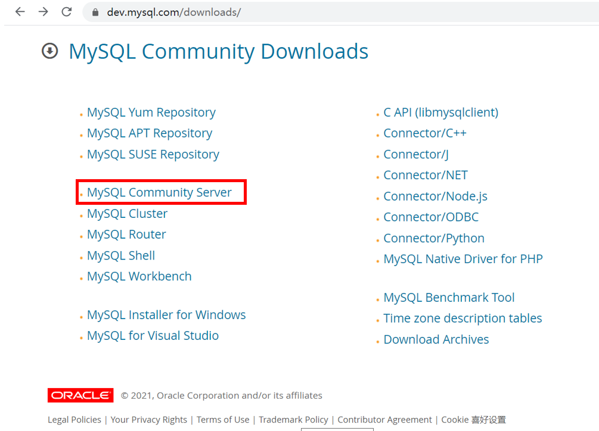
    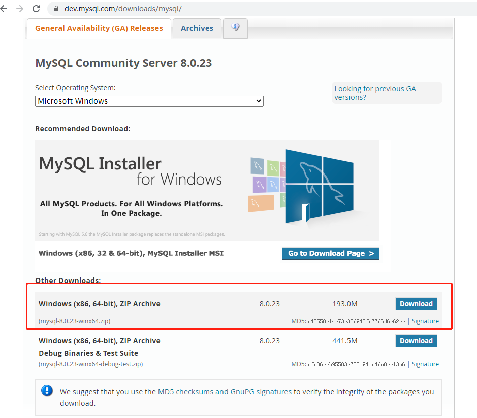

2. Mettez le fichier zip dans votre répertoire choisi et puis le dézippez.

    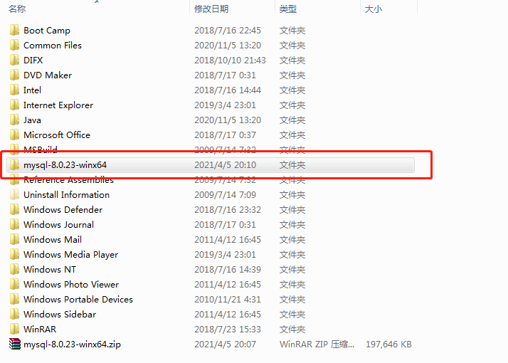

    Entrez dans son répertoire:
	
    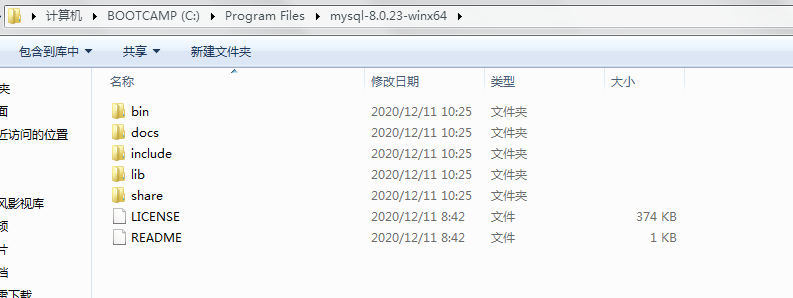

3. Ouvrez le cmd de Windows:

    - allez dans le sous-répertoire `bin` de mysql et puis lancez l'installation avec commande `mysqld -install`
	
    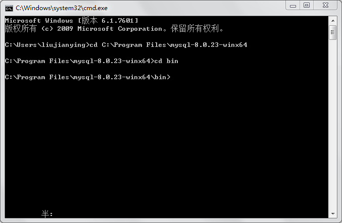

    **Si vous rencontrez l'erreur comme "Install/Remove of the Service Denied!", c'est un problème du droit, rouvrez la fenêtre `cmd` comme administrator et puis vous n'aurez pas de problème.**

    - Installation avec succès:
		
    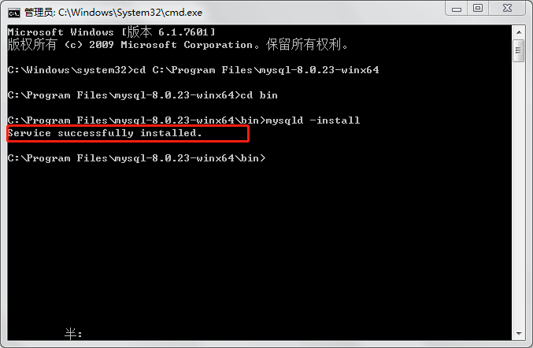

#### Configuration de MySQL

Toujours dans `cmd`, dans `mysql-8.0.23-winx64\bin`, lancez `mysqld -initialize`, cette commande va créer un sous-répertoire `data` dans `mysql-8.0.23-winx64`. Entrez dans ce sous-répertoire et trouvez un fichier avec extension `.err` qui contient un mot de passe temporaire pour la première utilisation de MySQL. Ouvrez-le avec votre éditeur et puis trouvez le mot de passe.

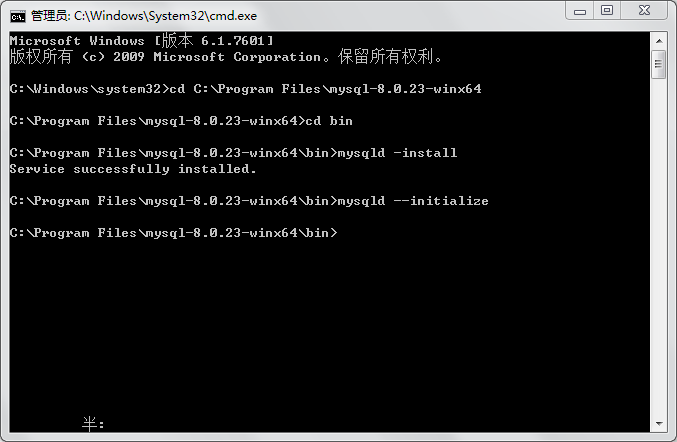
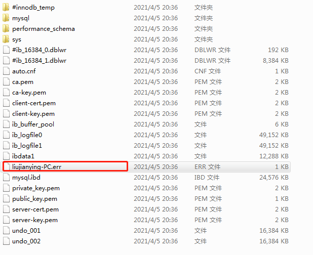
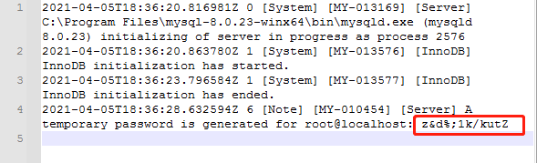

Rentrez maintenant dans `mysql-8.0.23-winx64`, créez un nouveau fichier `my.ini`, qui est la fichier de configuration de mysql, dans lequel, écrivez ces lignes:

```
[mysqld]
basedir=C:\Program Files\mysql-8.0.23-winx64
datadir=C:\Program Files\mysql-8.0.23-winx64\data
port=3306
```

**Attention: le chemin écrit après `basedir` et `datadir` est l'endroit où vous avez dézippé mysql**

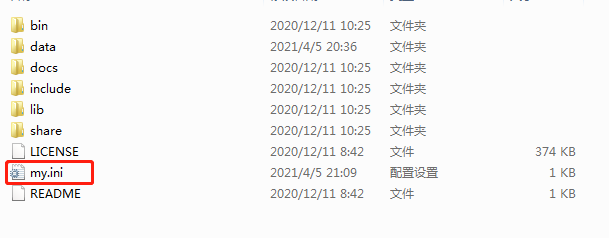

Sauvegardez-le, et puis on peut démarrer le service `mysql` avec `net start mysql` :

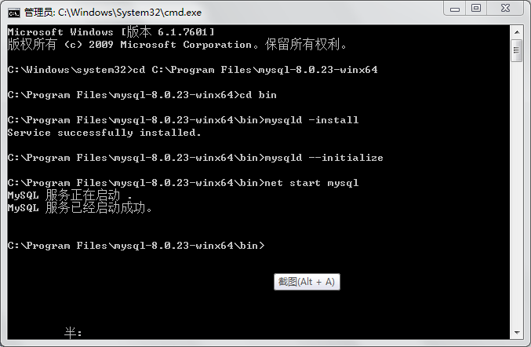

Tapez `mysql -u root -p` pour login (comme utilisateur `root`), utilisez le mot de passe qu'on vient de trouver.

Login avec succès:

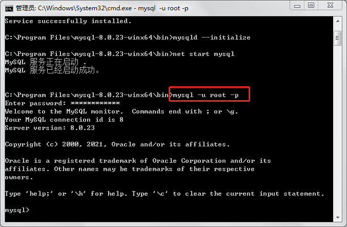

Ensuite, changez le mot de passe avec `ALTER USER root@localhost IDENTIFIED BY 'new_password'`

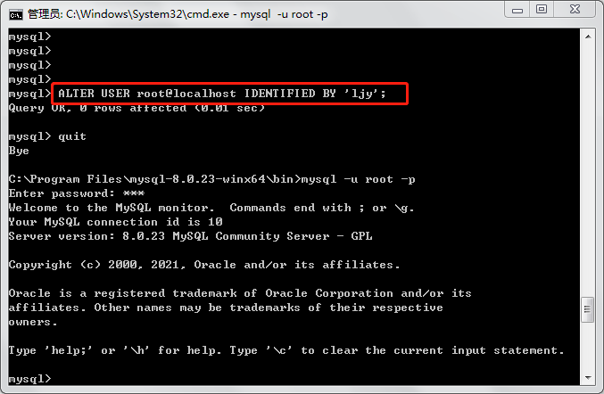

**Attention: pour utiliser directement le fichier `properties` dans notre programme, il vaut mieux garder l'user `root` et changer le mot de passe `ljy`. Si vous utilisez une autre configuration, il faut aussi changer ces informations dans `projetBDR/resources/properties`.**

Maintenant, vous démarrez MySQL dans répertoire 
`mysql-8.0.23-winx64\bin`, pour pouvoir l'utilisez dans cmd, n'importe où vous êtes, il faut ajouter le chemin absolu vers `\mysql-8.0.23-winx64\bin` au **PATH** dans la partie "variable système", on ne le traite pas ici.

Finalement, nous créons notre base de données avec la ligne de commande suivante :

`create database paristournage default character set utf8 collate utf8_bin;`

**Attention: comme le précédent, pour pouvoir directement utiliser la configuration dans notre programme, il vaut mieux garder le nom de base comme "paristournage", et on spécifie ici l'encodage à utiliser pour que notre base de données prenne en compte la casse et les accents.**

Maintenant, notre base de données est prête pour être connectée !

### Télécharger MySQL driver

Pour pouvoir se connecter au MySQL avec java, nous avons besoin d'un driver mysql-connector, téléchargez-le [ici](https://dev.mysql.com/downloads/connector/j/), choisissez "Platform Independent" pour OS.
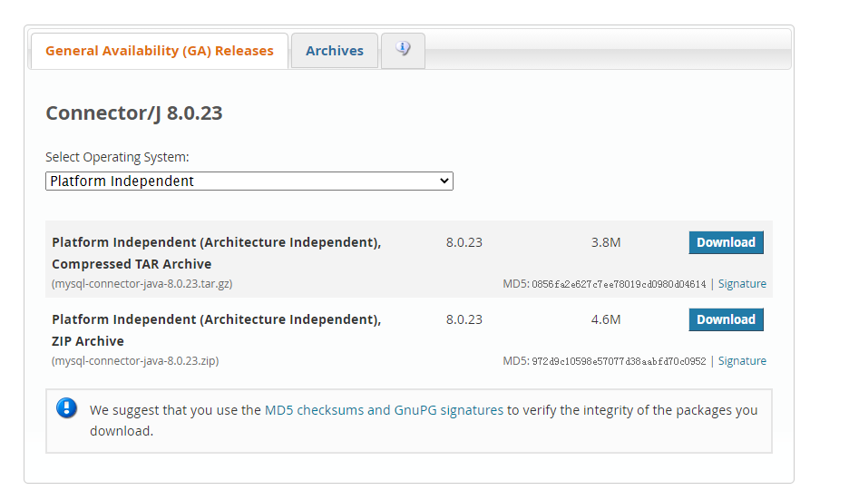

Ensuite, ajoutez le `mysql-connector-java-8.0.23.jar` dans notre projet dans eclipse. Maintenant, tout est prêt pour le lancement!